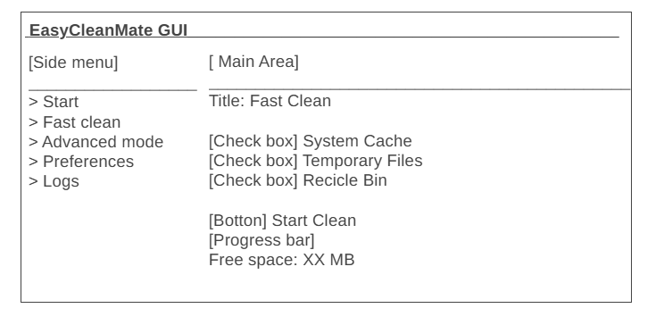

# Interface Project

## Projeto de Interface (Wireframe)

The easycleanmate Gui interface is designed to be simple and intuitive. Below is the wireframe of the main screen, highlighting the essential elements for user interaction.

*Figure 1:* Main screen wireframe

**Component Description:**
- Side menu with navigation between features
- Main area with selection of cleaning types
- Progress Visual Action and Visual Feedback button

